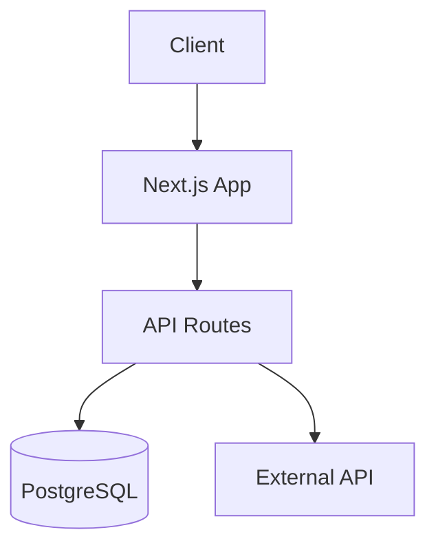

# excalidraw-diagrams

## When to Use
- System architecture visualization
- Data flow diagrams
- Infrastructure diagrams
- Component relationship maps
- DB schema sketches

## Diagram Types

| Type | Use Case | Mermaid Syntax |
|------|----------|----------------|
| Flowchart | Process flows | `flowchart TD` |
| Sequence | API interactions | `sequenceDiagram` |
| ER Diagram | Database schema | `erDiagram` |
| Class Diagram | Code structure | `classDiagram` |
| Architecture | System overview | `graph LR` |

## Steps
1. Understand what needs to be visualized
2. Choose appropriate diagram type
3. List all components and actors
4. Define relationships
5. Generate Mermaid code block
6. Offer Excalidraw JSON export if needed

## Example

